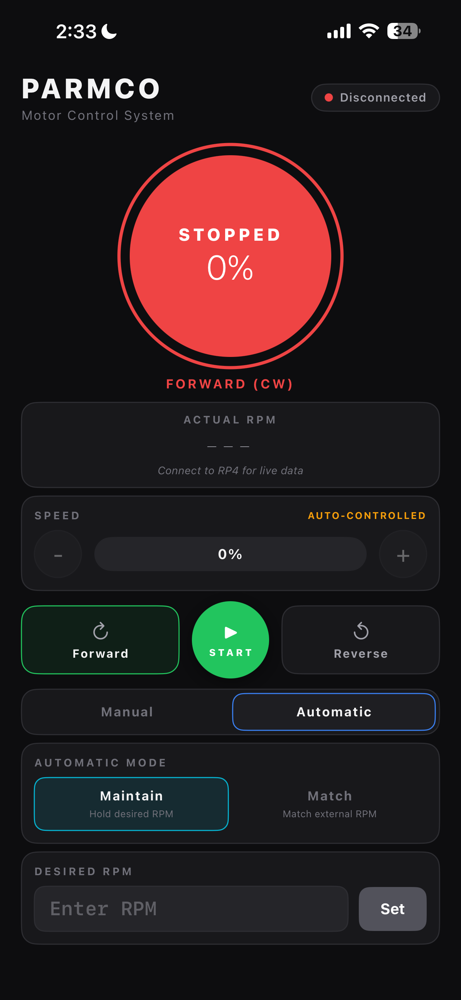

# PARMCO

PARMCO is a phone app that spins a real motor. You tap a control on an iPhone and a 12 volt DC motor
on the bench starts turning, reverses, ramps its speed, or holds a target speed on its own without
anyone touching the machine it is wired to.

**Live site: [jke48222.github.io/parmco](https://jke48222.github.io/parmco)**



## Where the code lives

This repository is the project **website** only: five static HTML pages, one stylesheet, and two
small scripts. There is no build step and no application code that runs the motor.

The engineering lives in the course repository, at `ECSE4235/FinalProject/final_project/`:

| Path | What it is |
| --- | --- |
| `ble/ble_server.c` | The Bluetooth server that runs on the Raspberry Pi. 2,337 lines. |
| `ble/Makefile`, `ble/parmco-ble.service` | Build and boot-service definition for that server. |
| `motor/motor_control.c` | Standalone keyboard-driven motor tool, used for bench debugging. 842 lines. |
| `motor/gpio_asm.s` | ARM assembly that writes the Pi's GPIO registers directly. 219 lines. |
| `PARMCO-iOS/PARMCO/*.swift` | The iPhone app. 1,686 lines across 6 files. |

**Read the course repository, not the copy in this one.** The `final_project/` folder here is a
snapshot taken on 2026-04-21, when this website was built (commit `e81adc3`). Development continued
in the course repository for two more days after that, and the two have since diverged in ways that
matter: the snapshot's `ble_server.c` is 1,946 lines with a proportional-only controller, while the
shipped version is 2,337 lines with a feedforward plus PI controller and different tuning
throughout. `ContentView.swift`, `BLEConnectionSheet.swift`, and `motor_control.c` also lag behind.
Everything described in this README is the shipped version. See [Status](#status).

A second phone client, React Native with Expo, was built alongside the SwiftUI one and lives at
`ECSE4235/FinalProject/Project_CP2/app/` and `Project_CP3/app/`. It was not carried into the final
deliverable, which ships the SwiftUI app only.

## What problem this solves

A small DC motor on a lab bench is normally driven open loop, from a knob or from a terminal on the
one machine that has the motor wired into it. Two things follow from that. You have to be standing
at the bench, and the number you dial in is a *duty cycle*, not a speed: ask for 60 percent and you
get whatever RPM the load happens to allow that day.

PARMCO removes both constraints. The control surface moves onto a phone, and the loop is closed on
the Pi so that a requested speed is actually held. The interesting part is that neither half was
allowed to be easy. The course required part of the GPIO path to be written in assembly, and
required the system to come up on its own at power-on with no console interaction (see
`final_project/CHANGES.md` and the `install` target in the Makefile). And rather than reach for a
Bluetooth library, the peripheral is built directly against the operating system's own Bluetooth
stack, which is a much larger job and the most interesting file in the project.

## How it works

Some vocabulary first, because the whole system is built out of it.

- **BLE** (Bluetooth Low Energy) is a two-role protocol. The **central** is the phone: it scans,
  connects, and initiates. The **peripheral** is the thing being connected to: it advertises itself
  and waits. Here the Raspberry Pi is the peripheral, which is the less common direction. Most
  hobby projects make the Pi the central and talk to a pre-built module.
- **GATT** (Generic Attribute Profile) is how BLE devices expose data. A peripheral publishes a
  *service* (identified by a UUID) containing *characteristics*, which are named values a central
  can read, write, or subscribe to. PARMCO publishes one service with two characteristics: one the
  phone writes commands into, one the phone subscribes to for a stream of RPM readings.
- An **H-bridge** is four switches arranged so current can be pushed through a motor in either
  direction. The L293D chip here is one. Two logic pins pick the direction, a third enables it.
- **PWM** (pulse width modulation) sets motor speed by switching that enable pin on and off very
  fast. The fraction of time it is on is the **duty cycle**.
- A **tachometer** measures rotation. Here it is an infrared sensor pointed at a three-blade
  propeller on the motor shaft, so each revolution produces three pulses.

The path a single tap takes:

```
iPhone (BLE central)                       Raspberry Pi 4 (BLE peripheral)
+---------------------------+              +--------------------------------------------+
| ContentView.swift         |              | ble_server.c, one GLib main loop            |
|   user taps / drags       |  write       |                                             |
| BLEManager.swift          | -----------> |  D-Bus dispatch -> parse_command()          |
|   CBCentralManager        | "SPD:75"     |    mutates motor_state                      |
|                           |              |                                             |
|                           |              |  GLib timer, 250 ms -> controller tick      |
|                           |              |    sample both IR channels, adjust duty     |
|                           |              |                                             |
| live RPM readout          | <----------- |  GLib timer, 200 ms -> telemetry notify     |
|                           |  notify      |                                             |
+---------------------------+              |  pigpio alert on GPIO17 -> count IR edges   |
                                           +--------------------------------------------+
                                                          |          ^
                                              GPIO18 PWM  |          | IR pulses (GPIO17)
                                              GPIO20/21   v          |
                                           +--------------------------------------------+
                                           | L293D H-bridge -> Nichibo PC-260SB, 12 V    |
                                           +--------------------------------------------+
```

### The BLE server, and why it is the good part

`ble_server.c` is 2,337 lines of C that turn the Pi into a BLE peripheral with no BLE framework
underneath it. Linux's Bluetooth stack, BlueZ, does not expose a C library for building a GATT
server. It exposes **D-Bus**, the desktop message bus, and expects your program to publish objects
on that bus that BlueZ then reads back. So the server is written against GLib and GDBus (the GNOME
event loop and its D-Bus binding) and hand-builds every object BlueZ needs:

- An `org.freedesktop.DBus.ObjectManager` implementation at `/com/parmco`, because BlueZ discovers
  your GATT tree by calling `GetManagedObjects` on you and reading what comes back.
- A GATT service object at `/com/parmco/service0` with two characteristic objects beneath it, each
  with its own property getters, its own `WriteValue` or `StartNotify` handler, and its own
  introspection XML.
- An `org.bluez.LEAdvertisingManager1` advertisement at `/com/parmco/adv0` so the Pi is discoverable
  as `PARMCO-RP4`.
- An `org.bluez.Agent1` pairing agent at `/com/parmco/agent` declaring `NoInputNoOutput` capability.

That last one is worth explaining, because it is the fix that made the demo possible. iOS starts a
pairing exchange the first time it connects to a peripheral with a writable characteristic. If
nothing on the Pi implements `Agent1`, BlueZ has no one to ask, prints "waiting for response from
Bluetooth device", and the iPhone hangs until it times out. Declaring `NoInputNoOutput` tells BlueZ
this device has no screen and no keypad, so "Just Works" pairing applies and the agent
auto-accepts. With it in place the Pi can be power-cycled, or forgotten in iOS Bluetooth settings
and reconnected, with nobody touching a keyboard on the Pi. The reasoning is written out in the file
header at `ble/ble_server.c:21-36`.

Note the security tradeoff this makes explicit: "Just Works" pairing means no authentication and no
protection against a man-in-the-middle. `CHANGES.md` lists it as a known limitation rather than
pretending otherwise.

### The command protocol

Plain UTF-8 strings written to the command characteristic. No JSON parser on either side.

| Command | Effect |
| --- | --- |
| `FWD`, `REV` | Direction |
| `START`, `STOP` | Motor on, motor off |
| `SPD:<0-100>` | Manual speed percent |
| `RPM:<0-6000>` | Target RPM for Maintain mode |
| `MODE:MANUAL` | Open-loop control |
| `AUTO:MAINTAIN` | Closed loop against the target RPM |
| `AUTO:MATCH` | Closed loop against a reference signal on GPIO23 |

Telemetry comes back on the notify characteristic as
`RPM:<actual>,REF:<ref>,M:<manual|maintain|match>`, every 200 ms while the motor is running and once
a second while idle. The parser in `BLEManager.swift` splits on commas then colons and ignores keys
it does not recognise, so an older build still parses a newer frame.

### The control loop

Three modes, one controller.

**Manual** is open loop: no feedback, the requested percentage becomes an 8-bit duty value (0 to
255) on the enable pin. Two adjustments sit in that path, both dealing with the fact that a small DC
motor does not turn at low duty. Any nonzero request below 40 percent is raised to 40
(`effective_manual_percent`, `ble/ble_server.c:326-331`), and starting from rest at a low setting
arms the same startup kick the closed-loop modes use. So the slider is not perfectly linear at the
bottom of its range, on purpose.

**Maintain** and **Match** are closed loop. Every 250 ms the controller samples both IR channels,
computes the error against a setpoint, and adjusts the duty cycle. Maintain's setpoint is the target
RPM sent from the phone. Match's setpoint is whatever is turning on the reference channel (GPIO23),
which can be a second IR sensor on another motor or a bench function generator.

The shipped controller is **feedforward plus PI**, not a plain proportional loop. Each tick it
starts from a feedforward duty estimated from the target RPM, then adds a correction with both a
proportional and an integral term. Constants at `ble/ble_server.c:263-274`:

| Constant | Value | What it does |
| --- | --- | --- |
| `KP` | 0.018 | Proportional gain, duty counts per RPM of error |
| `KI` | 0.0015 | Integral gain per tick |
| `CONTROL_DEADBAND` | 80.0 RPM | Error inside this band is zeroed |
| `MAX_ADJUST_PER_TICK` | 6 | Slew limit on the correction, in duty counts |
| `STALL_RPM_THRESHOLD` | 120.0 RPM | Below this, treat the motor as stalled |
| `BOOST_PERCENT`, `BOOST_MS` | 50 percent, 350 ms | Startup kick to break static friction |
| `MIN_SPIN_PERCENT` | 40 | Lowest duty that reliably keeps the motor turning |
| `LOW_RPM_EFFECTIVE_TARGET` | 700 RPM | Floor on the target. Ask for less and you get this. |
| `CONTROL_PERIOD_MS` | 250 | Tick rate |
| `PWM_MAX_DUTY` | 255 | 8-bit duty |

Three details are worth calling out, because each one is a fix for a real failure mode:

- **The integral term leaks.** When the error is inside the deadband the accumulator is multiplied
  by 0.85 rather than held, so it decays instead of parking a stale correction. It is also clamped
  to plus or minus 4,000 to bound windup.
- **The correction is slew limited** to 6 duty counts per tick. The motor responds mechanically on
  the order of a second while the loop ticks four times a second, so an unlimited proportional step
  would wind past the target before the motor could react.
- **There is a stiction floor.** A small DC motor below a certain duty does not turn at all, and a
  controller creeping up from zero will never reach it. So a stalled motor gets a fixed 50 percent
  kick for 350 ms, and the duty never falls below 40 percent while a low target is selected.

Two limits follow directly from those constants and are worth stating rather than glossing over.
The deadband is a deliberate accuracy tradeoff: inside plus or minus 80 RPM the error is treated as
zero, which with 3 pulses per revolution and a 250 ms window is roughly one pulse of tach
quantisation. And the usable target range starts at 700 RPM, not zero, because
`effective_target_rpm()` floors anything lower. This holds a speed within a band. It does not track
one precisely, and it should not be described as if it did.

**A documentation bug worth knowing about.** The block comment above `update_maintain_mode()`
(`ble/ble_server.c:664-673`) still describes the *previous* design: "Both auto modes are P-only",
`Kp = 0.04`, a 30 RPM deadband. That was true before the final retune and is not true of the code
underneath it. If you read that comment and stop there, you will describe the wrong controller.

### The tachometer

`gpioSetAlertFunc` registers a callback that fires on GPIO edges. `ir_edge_cb` keeps falling edges
only and rejects any edge closer than `MIN_PULSE_US` (1,000 microseconds) to the last one, which
throws out sensor bounce. With `PULSES_PER_REV` set to 3 for the three-blade propeller and a
250 ms sliding window (`RPM_WINDOW_MS`), RPM falls out of the pulse count directly.

### PWM, and one correction to the published site

The PWM runs at **20 kHz**, set by `gpioSetPWMfrequency(PIN_ENABLE, 20000)` at
`ble/ble_server.c:456`, with an 8-bit duty range. Above the audible band, so the motor does not
whine. The site is right about this.

The site is wrong about one thing, and this README is the corrected version: it calls this
"hardware DMA PWM." **It is DMA-timed *software* PWM.** pigpio's `gpioPWM()` programs the Pi's DMA
engine to toggle the pin on a schedule; it does not use the SoC's dedicated PWM peripheral. GPIO18
is hardware-PWM-capable, but `gpioHardwarePWM()` is never called anywhere in this project. The
distinction matters because the two have different jitter characteristics and different constraints
on what else can use the DMA channels.

### The assembly is ARMv7, not ARMv8

`gpio_asm.s` maps `/dev/gpiomem` and writes the BCM2711 GPIO registers directly: `GPFSEL` to set a
pin's function, `GPSET0` at offset 0x1C to drive it high, `GPCLR0` at offset 0x28 to drive it low.
Those set and clear registers are write-1-to-act, so toggling one pin cannot disturb another, which
is why they exist instead of a read-modify-write register.

The chip is a Cortex-A72, which is an ARMv8-A core, and that is probably where the confusion starts.
But **the code is 32-bit ARMv7 (AArch32)**, not ARMv8. The file declares `.arch armv7ve` and `.arm`
at lines 55 to 57, uses 32-bit registers throughout (`push {r4-r8, lr}`, `ldr r1, =...`, `udiv r7,
r5, r6`, `bx lr`), and its own header says "32-bit ARM (AArch32/ARMv7-A)" and "AAPCS32 Calling
Convention." The motor Makefile forces `-marm` to keep GCC out of Thumb mode. An ARMv8 core runs
AArch32 code perfectly well; the instruction set the source targets is the thing being named here,
and that is ARMv7.

## AI disclosure

This is stated on the project's own site and in its source headers, and it is repeated here rather
than buried:

> All code was generated by AI, then validated, debugged, and extended.

The tool was Claude Opus 4.6 (Anthropic), March 2026. Gemini 2.5 Pro was used for pre-coding
research on BlueZ, pigpio, the L293D, and AAPCS32. Every source file carries an attribution header,
and human edits are bracketed with `=== HUMAN EDIT START ===` and `=== HUMAN EDIT END ===` markers
with the original generated code preserved in comments above each one.

Those markers are countable. In the shipped version, every one of them is attributed to Jalen Edusei:

| File | Human-edit blocks |
| --- | --- |
| `ble_server.c` | 21 |
| `ContentView.swift` | 12 |
| `MotorState.swift` | 3 |
| `BLEManager.swift` | 1 |
| `BLEConnectionSheet.swift` | 1 |
| `motor_control.c`, `gpio_asm.s`, `Theme.swift`, `PARMCOApp.swift` | 0 |

One caveat on reading those counts as an authorship record: the last commit to touch
`ble_server.c` was Justin Moreno's (`5af2a0d`, 2026-04-22, 384 insertions and 174 deletions), and it
rewrote code sitting inside blocks whose markers say "Jalen." The markers track where a human
changed generated code, not who the human was. Git is the better record. See below.

## Who built what

ECSE 4235, University of Georgia, Spring 2026, Group 07. Two people. In the course repository, git
records 139 commits from Jalen Edusei and 42 from Justin Moreno.

| Area | Owner |
| --- | --- |
| SwiftUI and CoreBluetooth iOS app | Jalen Edusei |
| React Native and Expo app | Jalen Edusei |
| BLE GATT server, `ble_server.c` | Jalen Edusei |
| `NoInputNoOutput` pairing agent | Jalen Edusei |
| systemd service unit | Jalen Edusei |
| L293D wiring and bench testing | Justin Moreno |
| IR sensor and GPIO17 wiring | Justin Moreno |
| Motor firmware, `motor_control.c` | Justin Moreno |
| ARMv7 GPIO assembly, `gpio_asm.s` | Justin Moreno |
| pigpio DMA PWM integration | Justin Moreno |
| Original proportional RPM controller | Justin Moreno |
| Checkpoint reports and documentation | Both |

The closed-loop controller does not fit neatly into either row, and git tells the story better than
the table does:

1. Justin wrote the **original** proportional controller, in the standalone keypad binary.
2. Jalen **ported closed-loop control into the BLE server**, which is the headline change of the
   final deliverable and what `CHANGES.md` documents. That version was proportional only, with
   `KP = 0.04` and a 30 RPM deadband.
3. Justin then **retuned and substantially extended it** in commit `5af2a0d` on 2026-04-22: the
   integral term, the slew limit, stall detection, the startup boost, the feedforward duty map, and
   the shorter RPM window all arrive in that one commit. That is the controller described in
   [The control loop](#the-control-loop), and it is the one that shipped.

The website's snapshot of the source predates step 3, which is why it still shows a P-only loop.

## Results

Honest accounting. **The repository contains no measurement data.** There are no logs, no CSVs, no
oscilloscope captures, and no plots anywhere in it. Every performance number below traces to prose
written by the authors, so all of it is a bench observation, not a measurement.

| Claim | Value | Where the claim comes from | Caveat |
| --- | --- | --- | --- |
| Settling time to a 4,500 RPM target in Maintain | About 1 second, no visible overshoot | Code comment at `ble/ble_server.c:667-669`, repeated in `CHANGES.md` | Describes the P-only controller with `KP = 0.04`, which was replaced before ship. Nobody re-measured after the retune. |
| Observed top speed with the IR flag mounted | About 5,400 RPM, against a 6,000 RPM unloaded spec | `index.html`, section 04 | |
| Recovery after a power cycle to phone reconnect | About 45 seconds | `index.html`, section 04 | |

The first row is the weakest claim in the project and is worth being blunt about: it is a comment
that outlived the code it described. The number was never re-established for the controller that
actually ships.

What *is* verifiable from the repository itself:

| Fact | Value |
| --- | --- |
| BLE server | 2,337 lines of C |
| iOS app | 1,686 lines of Swift across 6 files |
| Keypad debug tool and the assembly | 842 and 219 lines |
| Controller tick rate | 250 ms |
| Telemetry rate | 200 ms running, 1 Hz idle |
| PWM | 20 kHz, 8-bit duty, DMA-timed software PWM |
| Compile check | `gcc -Wall -Wextra -fsyntax-only` clean, per `CHANGES.md` section 5 |

There is no automated test suite. Verification was a demo script: cold boot, scan, connect, forward,
reverse, start, stop, speed ramp, target RPM, and a forget-device plus power-cycle reconnect, all
without touching the Pi.

## Running it

### The website

Static files, no build step, no dependencies.

```bash
python3 -m http.server 8000
```

Then open `http://localhost:8000`. Or open `index.html` directly in a browser.

### The system itself

Requires a Raspberry Pi 4 Model B running 64-bit Raspberry Pi OS (Bookworm), an L293D, a 12 V
Nichibo PC-260SB motor with a three-blade propeller, an IR sensor, and a 12 V supply. Run from
`ECSE4235/FinalProject/final_project/ble/`, not from this repository:

```bash
sudo apt update
sudo apt install -y build-essential libglib2.0-dev bluetooth bluez \
                    libbluetooth-dev pkg-config pigpio
make
sudo ./ble_server
```

A successful start prints registration lines for the ObjectManager, the GATT service, both
characteristics, and the advertisement, then `Advertising...` and a wait for a phone connection.

To install it as a boot service:

```bash
make install                                # copies to /usr/local/bin, enables the unit
sudo systemctl status parmco-ble.service
sudo journalctl -u parmco-ble.service -f
make uninstall                              # to remove
```

For the iPhone app, see `PARMCO-iOS/README.md` in the course repository. No `.xcodeproj` is checked
in, so the Swift files have to be added to a new Xcode iOS App target by hand.

## Pin map

| Pin | Direction | Connects to | Function |
| --- | --- | --- | --- |
| GPIO18 | Output, PWM | L293D pin 1, EN1,2 | Speed. 20 kHz DMA-timed PWM, duty 0 to 255 |
| GPIO21 | Output | L293D pin 2, IN1 | Direction bit A |
| GPIO20 | Output | L293D pin 7, IN2 | Direction bit B |
| GPIO17 | Input, pull-up | IR sensor output | Tachometer. Falling edges, 1,000 microsecond bounce filter |
| GPIO23 | Input, pull off | External reference | Match-mode reference. Pull is off so a function generator is not fighting it |

GPIO peripheral base is `0xFE200000` on the BCM2711, mapped via `/dev/gpiomem`.

## Project layout

```
parmco/                     This repository: the website
├── index.html              Overview
├── how-it-works.html       Tap to spin, layer by layer
├── architecture.html       Schematic, pin map, software stack, concurrency model
├── checkpoints.html        CP1 through Final
├── team.html               Members, ownership table, AI attribution
├── style.css               All styling
├── bg-effects.js           Canvas background effects
├── tweaks.js               Scroll reveals, nav behaviour
├── images/                 App screenshot, member photos
└── final_project/          Flattened reading copy of the engineering source

ECSE4235/FinalProject/final_project/     The engineering repository
├── ble/                    ble_server.c, Makefile, systemd unit
├── motor/                  motor_control.c, gpio_asm.s, Makefile
├── PARMCO-iOS/PARMCO/      SwiftUI app source
├── docs/                   Checkpoint writeups
└── CHANGES.pdf             CP3 to Final change log
```

## Status

Complete and demonstrated. Four checkpoints delivered, February through April 2026.

Known gaps and rough edges, in the order they would matter to someone picking this up. The first
three are all the same underlying problem, which is that the documentation stopped tracking the code
two days before the code stopped changing.

- **The source in `final_project/` here is two days stale.** It is the 2026-04-21 snapshot taken
  when this site was built. The shipped `ble_server.c` is 2,337 lines, not 1,946, and its controller
  is feedforward plus PI, not proportional only. `ContentView.swift`, `BLEConnectionSheet.swift`,
  and `motor_control.c` also lag. Read the course repository.
- **`final_project/` here also does not build.** It is a flat copy, but the Makefile in it expects
  the original two-folder layout and looks for `../motor/gpio_asm.o`.
- **`final_project/README.md` here is stale in a different way.** It is the Checkpoint 2 version and
  still describes mock RPM telemetry and a five-command protocol. The current one is at
  `ECSE4235/FinalProject/final_project/README.md`.
- **A stale comment in the shipped source.** `ble/ble_server.c:664-673` still describes the
  superseded P-only controller. Fixing that comment is a five-minute job and it is the thing most
  likely to mislead the next reader.
- **The site calls the PWM "hardware DMA PWM."** It is DMA-timed software PWM. The 20 kHz figure on
  the site is correct. The site has not been re-published with the fix.
- **No measurement artifacts.** Every performance figure is a bench observation recorded in prose,
  and the settle-time figure describes a controller that no longer exists. The single highest-value
  addition to this project would be logging the telemetry stream to a CSV during a step response and
  committing the plot, which would turn "about 1 second, no visible overshoot" into something a
  reader could check against the controller that actually ships.
- **Pairing is unauthenticated.** "Just Works" with `NoInputNoOutput` was the right call for a lab
  demo and the wrong call for anything else.
- **No test suite.** Verification was the demo script.

---

Jalen Edusei and Justin Moreno. ECSE 4235, University of Georgia, Spring 2026, Group 07.
